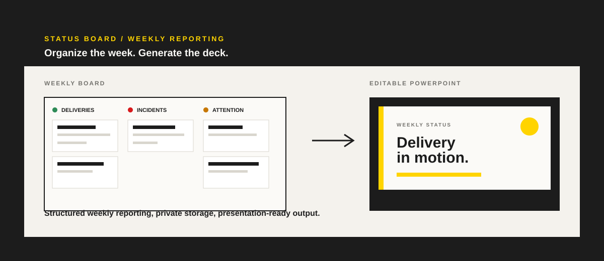
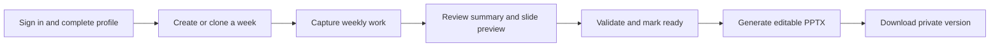
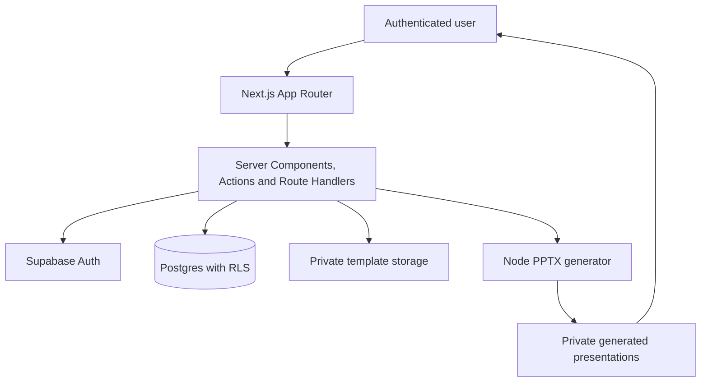

<p align="center">
  <a href="./README.md">Português</a> &nbsp;|&nbsp; <strong>English</strong>
</p>

<p align="center">
  
</p>

<h1 align="center">Status Board</h1>

<p align="center">
  <strong>Structure the week. Generate an editable presentation.</strong><br />
  A reporting workspace for individual contributors who need a clear weekly narrative without rebuilding slides from scratch.
</p>

<p align="center">
  <a href="https://github.com/dtdias/status-board/actions/workflows/verification.yml"></a>
  
  
  
  
</p>

<p align="center">
  <a href="https://status-board-pi-rosy.vercel.app">Open deployment</a>
  &nbsp;·&nbsp;
  <a href="#quick-start">Quick start</a>
  &nbsp;·&nbsp;
  <a href="#architecture">Architecture</a>
</p>

> The published app requires an authenticated user. The `/` route redirects to `/login`.

## Why it exists

Weekly reporting is often split between notes, trackers, and a last-minute slide deck. Status Board keeps the operational record in one place, applies a consistent content model, and produces a versioned editable PPTX from the approved master template.

It is a **reporting workflow**, not a PowerPoint editor.

## What it delivers

| Organize | Validate | Present |
| --- | --- | --- |
| Build a weekly board for deliveries, incidents, demands, support, and attention items. | See automatic summaries, content limits, and readiness checks before generation. | Create a private, versioned PPTX that retains the approved visual master. |

### Workflow



### Included capabilities

- Weekly reports with draft, ready, generated, presented, and archived lifecycle states.
- Previous-week cloning with selectable content areas.
- Structured sections for deliveries, production incidents, new demands, support routines, dependencies, and next steps.
- Automatic summary plus accessible HTML/CSS slide preview.
- Pointer and keyboard drag-and-drop ordering for deliveries.
- Pre-generation validation, content limits, pagination, and absence messages for empty sections.
- PPTX generation with `pptx-automizer`, preserving the approved template's shapes, icons, fonts, colors, and layout.
- Immutable private storage for both presentation templates and generated deck versions.
- Database-backed allowlist for template administrators.

## Architecture



The generator receives an independent `PresentationInput` DTO and the template as a buffer. It does not query the database and does not use persistent function disk. Version reservation happens through Postgres before private Storage upload, preventing concurrent generation collisions.

## Stack

| Layer | Choice |
| --- | --- |
| Application | Next.js 16, React 19, TypeScript |
| UI | Tailwind CSS 4, custom editorial CSS, dnd-kit |
| Platform | Vercel, Node.js 22+ |
| Data and identity | Supabase Auth, Postgres, Row Level Security |
| Files | Private Supabase Storage |
| Presentations | pptx-automizer, JSZip |
| Quality | ESLint, Vitest, Playwright |

## Quick start

### Requirements

- Node.js 22+
- npm 10
- A Supabase project with an Auth user
- The approved `Template(1).pptx` master

### Install

```bash
npm ci
cp .env.example .env.local
npm run dev
```

Set server-only values in `.env.local`:

```dotenv
SUPABASE_URL=https://<project-ref>.supabase.co
SUPABASE_PUBLISHABLE_KEY=<Supabase publishable key>
PPTX_TEMPLATE_VERSION=v1
```

Apply migrations `0001` through `0006`, then upload the reviewed template to:

```text
presentation-templates/status-weekly/v1/template.pptx
```

No browser client imports Supabase. The publishable key is server-only in this project, while RLS remains the data-access boundary. `SUPABASE_SERVICE_ROLE_KEY` is not used.

## Quality gates

```bash
npm run lint
npm run typecheck
npm test
npm run build
```

The required GitHub Actions workflow runs `npm ci`, linting, typechecking, unit tests, and the production build. Browser E2E is deliberately isolated and runs only when its dedicated environment and secrets are configured.

```bash
npx playwright install chromium
npm run test:e2e
```

## Security and operations

- Report records and generated presentations are owner-scoped with Row Level Security.
- Storage buckets are private; downloads pass through authenticated application routes.
- Template uploads require an explicit database allowlist.
- Generation runs in the Node runtime and returns Buffers only; serverless disk is never used for persistence.
- Generated PPTX output is validated for expected ZIP/XML structure before storage.

## Documentation

- [Production setup](docs/production-setup.md)
- [E2E setup](docs/e2e.md)
- [Template administration](docs/template-administration.md)
- [PPTX generator foundation](docs/architecture/pptx-generator-foundation.md)
- [Product requirements and technical specification](PRD.md)

## Scope notes

- The HTML preview supports review before generation; it is not a pixel-for-pixel PowerPoint renderer.
- Drag-and-drop ordering currently applies to deliveries only.
- The project does not include a public signup flow, license, or contribution guide.

---

Built for clear weekly reporting and presentation-ready delivery.
