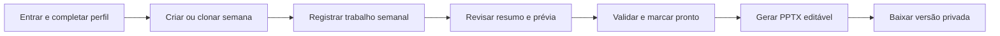
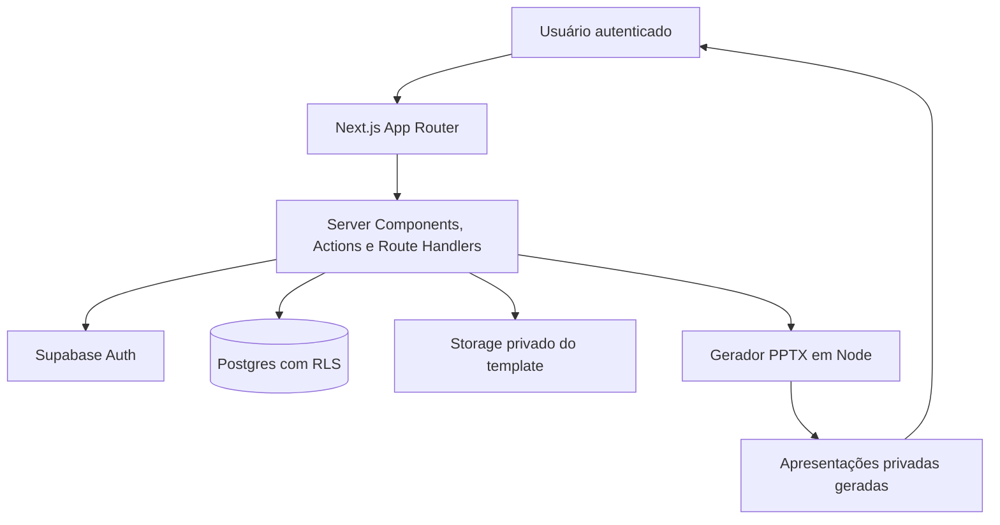

<p align="center">
  <strong>Português</strong> &nbsp;|&nbsp; <a href="./README.en.md">English</a>
</p>

<p align="center">
  
</p>

<p align="center">
  <strong>Organize a semana. Gere uma apresentação editável.</strong><br />
  Um espaço de reporte para quem precisa transformar trabalho semanal em uma narrativa clara, sem reconstruir slides do zero.
</p>

<p align="center">
  <a href="https://github.com/dtdias/status-board/actions/workflows/verification.yml"></a>
  
  
  
  
</p>

<p align="center">
  <a href="https://status-board-pi-rosy.vercel.app">Abrir ambiente publicado</a>
  &nbsp;·&nbsp;
  <a href="#início-rápido">Início rápido</a>
  &nbsp;·&nbsp;
  <a href="#arquitetura">Arquitetura</a>
</p>

> O ambiente publicado exige usuário autenticado. A rota `/` redireciona para `/login`.

## Por que existe

O reporte semanal costuma ficar dividido entre notas, planilhas e uma apresentação feita às pressas. Status Board reúne o registro operacional em um só lugar, aplica um modelo consistente de conteúdo e gera um PPTX editável e versionado a partir do template visual aprovado.

É um **fluxo de reporte**, não um editor de PowerPoint.

## O que entrega

| Organizar | Validar | Apresentar |
| --- | --- | --- |
| Monte o board semanal com entregas, incidentes, demandas, sustentação e pontos de atenção. | Revise resumo automático, limites de conteúdo e validações antes de gerar. | Crie um PPTX privado e versionado, preservando o master visual aprovado. |

### Fluxo



### Capacidades incluídas

- Relatórios semanais com ciclo de vida: rascunho, pronto, gerado, apresentado e arquivado.
- Clonagem da semana anterior com áreas de conteúdo selecionáveis.
- Seções estruturadas para entregas, incidentes em produção, novas demandas, rotinas de sustentação, dependências e próximos passos.
- Resumo automático e preview PPTX fiel ao template antes e depois da geração.
- Ordenação de entregas por drag-and-drop com ponteiro e teclado.
- Validação antes da geração, limites de conteúdo, paginação e mensagens para seções vazias.
- Geração PPTX com `pptx-automizer`, preservando shapes, ícones, fontes, cores e posições do template aprovado.
- Storage privado e imutável para templates e versões das apresentações.
- Allowlist no banco para administração de templates.
- Instalação como PWA online-first com fallback público quando não houver conexão.

## Arquitetura



O gerador recebe um DTO independente, `PresentationInput`, e o template em buffer. Ele não consulta o banco nem usa disco persistente da função. A versão é reservada no Postgres antes do upload em Storage, evitando colisões em gerações concorrentes.

## Stack

| Camada | Escolha |
| --- | --- |
| Aplicação | Next.js 16, React 19, TypeScript |
| Interface | Tailwind CSS 4, CSS editorial próprio, dnd-kit |
| Plataforma | Vercel, Node.js 22+ |
| Dados e identidade | Supabase Auth, Postgres, Row Level Security |
| Arquivos | Supabase Storage privado |
| Apresentações | pptx-automizer, JSZip |
| Qualidade | ESLint, Vitest, Playwright |

## Início rápido

### Requisitos

- Node.js 22+
- npm 10
- Projeto Supabase com usuário Auth
- Master `Template(1).pptx` aprovado

### Instalação

```bash
npm ci
cp .env.example .env.local
npm run dev
```

Configure valores server-only em `.env.local`:

```dotenv
SUPABASE_URL=https://<project-ref>.supabase.co
SUPABASE_PUBLISHABLE_KEY=<Supabase publishable key>
APP_URL=http://localhost:3000
PPTX_TEMPLATE_VERSION=v1
```

Execute as migrations `0001` até `0007` e envie o template revisado para:

```text
presentation-templates/status-weekly/v1/template.pptx
```

Não há client Supabase no browser. Neste projeto, a publishable key é server-only, enquanto RLS continua sendo a fronteira de acesso aos dados. A exclusão de conta usa uma Edge Function protegida; a `service_role` fica somente nos secrets da Function.

## Quality gates

```bash
npm run lint
npm run typecheck
npm test
npm run build
```

O workflow obrigatório do GitHub Actions executa `npm ci`, lint, typecheck, testes unitários e build de produção. E2E de browser é isolado de propósito e executa somente quando o ambiente e secrets dedicados estão configurados.

```bash
npx playwright install chromium
npm run test:e2e
```

## Segurança e operação

- Dados do relatório e apresentações geradas são protegidos por ownership e Row Level Security.
- Buckets são privados; downloads passam por rotas autenticadas da aplicação.
- Upload de template requer allowlist explícita no banco.
- Geração roda no runtime Node e retorna somente buffers; disco serverless não é usado para persistência.
- PPTX gerado passa por validação de estrutura ZIP/XML esperada antes do armazenamento.
- Cadastro exige confirmação de e-mail; Auth impede mais de uma conta por e-mail.
- Reenvio de confirmação protegido por cooldown de cinco minutos.
- Recuperação de senha e acesso por Magic Link sem criação automática de conta.
- Exclusão de conta remove dados pessoais, relatórios e arquivos PPTX gerados de forma irreversível.

## Documentação

- [Setup de produção](docs/production-setup.md)
- [Setup E2E](docs/e2e.md)
- [Administração de templates](docs/template-administration.md)
- [Fundação do gerador PPTX](docs/architecture/pptx-generator-foundation.md)
- [Requisitos de produto e especificação técnica](PRD.md)

## Notas de escopo

- Preview executa mesmo gerador/template em memória antes da geração; histórico renderiza bytes da versão salva. Tudo local no navegador, sem upload externo ou conversão no servidor.
- Drag-and-drop de ordenação existe atualmente apenas para entregas.
- O projeto não inclui fluxo público de cadastro, licença ou guia de contribuição.

---

Feito para reporte semanal claro e entrega pronta para apresentação.
